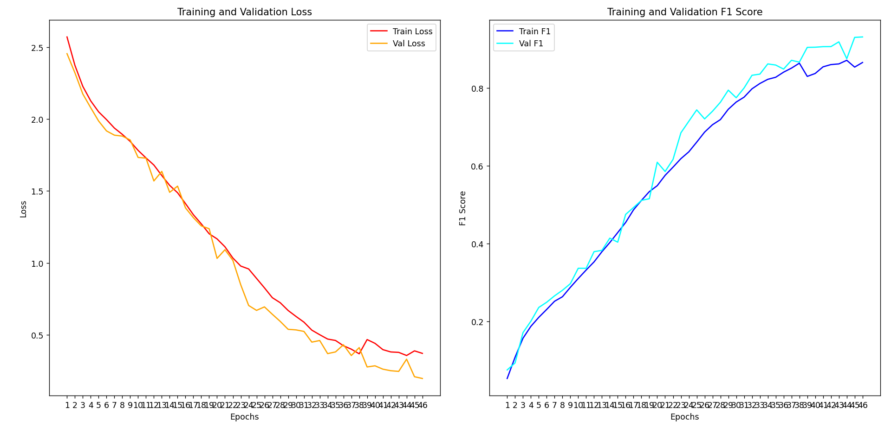

# ml_yaProj2024 (Human Pose Classification)

PyTorch solution for classifying human activity/pose images into 20 categories for the ML Intensive Yandex Academy Autumn 2024 competition.

## Overview

This project trains a custom CNN with:
- residual/skip connections
- Squeeze-and-Excitation blocks
- dropout and batch normalization
- data augmentation
- macro F1 as the main validation metric

It also generates a `submission.csv` file for competition upload.

## Dataset

Expected dataset layout after extraction:

```text
/content/Dataset/human_poses_data/
├── img_train/
├── img_test/
├── train_answers.csv
└── activity_categories.csv
```

### CSV files
- `train_answers.csv` — training image IDs and labels
- `activity_categories.csv` — class ID to category mapping

## Model

The model is a custom CNN:
- several `SkipConnectionBlock` stages
- `SEBlock` attention modules
- max pooling between stages
- adaptive average pooling at the end
- MLP classifier head

### Model summary

| Layer (type)                | Output Shape            | Param # |
|-----------------------------|-------------------------|----------|
| Conv2d‑1                    | [-1, 16, 256, 256]      | 64 |
| Conv2d‑2                    | [-1, 16, 256, 256]      | 448 |
| BatchNorm2d‑3               | [-1, 16, 256, 256]      | 32 |
| Dropout2d‑4                 | [-1, 16, 256, 256]      | 0 |
| Conv2d‑5                    | [-1, 16, 256, 256]      | 2,320 |
| BatchNorm2d‑6               | [-1, 16, 256, 256]      | 32 |
| Dropout2d‑7                 | [-1, 16, 256, 256]      | 0 |
| AdaptiveAvgPool2d‑8         | [-1, 16, 1, 1]          | 0 |
| Linear‑9                    | [-1, 1]                 | 17 |
| Linear‑10                   | [-1, 16]                | 32 |
| SEBlock‑11                  | [-1, 16, 256, 256]      | 0 |
| SkipConnectionBlock‑12      | [-1, 16, 256, 256]      | 0 |
| MaxPool2d‑13                | [-1, 16, 128, 128]      | 0 |
| Conv2d‑14                   | [-1, 64, 128, 128]      | 1,088 |
| Conv2d‑15                   | [-1, 64, 128, 128]      | 9,280 |
| BatchNorm2d‑16              | [-1, 64, 128, 128]      | 128 |
| Dropout2d‑17                | [-1, 64, 128, 128]      | 0 |
| Conv2d‑18                   | [-1, 64, 128, 128]      | 36,928 |
| BatchNorm2d‑19              | [-1, 64, 128, 128]      | 128 |
| Dropout2d‑20                | [-1, 64, 128, 128]      | 0 |
| AdaptiveAvgPool2d‑21        | [-1, 64, 1, 1]          | 0 |
| Linear‑22                   | [-1, 4]                 | 260 |
| Linear‑23                   | [-1, 64]                | 320 |
| SEBlock‑24                  | [-1, 64, 128, 128]      | 0 |
| SkipConnectionBlock‑25      | [-1, 64, 128, 128]      | 0 |
| MaxPool2d‑26                | [-1, 64, 64, 64]        | 0 |
| Conv2d‑27                   | [-1, 128, 64, 64]       | 8,320 |
| Conv2d‑28                   | [-1, 128, 64, 64]       | 73,856 |
| BatchNorm2d‑29              | [-1, 128, 64, 64]       | 256 |
| Dropout2d‑30                | [-1, 128, 64, 64]       | 0 |
| Conv2d‑31                   | [-1, 128, 64, 64]       | 147,584 |
| BatchNorm2d‑32              | [-1, 128, 64, 64]       | 256 |
| Dropout2d‑33                | [-1, 128, 64, 64]       | 0 |
| AdaptiveAvgPool2d‑34        | [-1, 128, 1, 1]         | 0 |
| Linear‑35                   | [-1, 8]                 | 1,032 |
| Linear‑36                   | [-1, 128]               | 1,152 |
| SEBlock‑37                  | [-1, 128, 64, 64]       | 0 |
| SkipConnectionBlock‑38      | [-1, 128, 64, 64]       | 0 |
| MaxPool2d‑39                | [-1, 128, 32, 32]       | 0 |
| Conv2d‑40                   | [-1, 256, 32, 32]       | 33,024 |
| Conv2d‑41                   | [-1, 256, 32, 32]       | 295,168 |
| BatchNorm2d‑42              | [-1, 256, 32, 32]       | 512 |
| Dropout2d‑43                | [-1, 256, 32, 32]       | 0 |
| Conv2d‑44                   | [-1, 256, 32, 32]       | 590,080 |
| BatchNorm2d‑45              | [-1, 256, 32, 32]       | 512 |
| Dropout2d‑46                | [-1, 256, 32, 32]       | 0 |
| AdaptiveAvgPool2d‑47        | [-1, 256, 1, 1]         | 0 |
| Linear‑48                   | [-1, 16]                | 4,112 |
| Linear‑49                   | [-1, 256]               | 4,352 |
| SEBlock‑50                  | [-1, 256, 32, 32]       | 0 |
| SkipConnectionBlock‑51      | [-1, 256, 32, 32]       | 0 |
| MaxPool2d‑52                | [-1, 256, 16, 16]       | 0 |
| Conv2d‑53                   | [-1, 512, 16, 16]       | 131,584 |
| Conv2d‑54                   | [-1, 512, 16, 16]       | 1,180,160 |
| BatchNorm2d‑55              | [-1, 512, 16, 16]       | 1,024 |
| Dropout2d‑56                | [-1, 512, 16, 16]       | 0 |
| Conv2d‑57                   | [-1, 512, 16, 16]       | 2,359,808 |
| BatchNorm2d‑58              | [-1, 512, 16, 16]       | 1,024 |
| Dropout2d‑59                | [-1, 512, 16, 16]       | 0 |
| AdaptiveAvgPool2d‑60        | [-1, 512, 1, 1]         | 0 |
| Linear‑61                   | [-1, 32]                | 16,416 |
| Linear‑62                   | [-1, 512]               | 16,896 |
| SEBlock‑63                  | [-1, 512, 16, 16]       | 0 |
| SkipConnectionBlock‑64      | [-1, 512, 16, 16]       | 0 |
| MaxPool2d‑65                | [-1, 512, 8, 8]         | 0 |
| Conv2d‑66                   | [-1, 1024, 8, 8]        | 525,312 |
| Conv2d‑67                   | [-1, 1024, 8, 8]        | 4,719,616 |
| BatchNorm2d‑68              | [-1, 1024, 8, 8]        | 2,048 |
| Dropout2d‑69                | [-1, 1024, 8, 8]        | 0 |
| Conv2d‑70                   | [-1, 1024, 8, 8]        | 9,438,208 |
| BatchNorm2d‑71              | [-1, 1024, 8, 8]        | 2,048 |
| Dropout2d‑72                | [-1, 1024, 8, 8]        | 0 |
| AdaptiveAvgPool2d‑73        | [-1, 1024, 1, 1]        | 0 |
| Linear‑74                   | [-1, 64]                | 65,600 |
| Linear‑75                   | [-1, 1024]              | 66,560 |
| SEBlock‑76                  | [-1, 1024, 8, 8]        | 0 |
| SkipConnectionBlock‑77      | [-1, 1024, 8, 8]        | 0 |
| AdaptiveAvgPool2d‑78        | [-1, 1024, 1, 1]        | 0 |
| Flatten‑79                  | [-1, 1024]              | 0 |
| Linear‑80                   | [-1, 1024]              | 1,049,600 |
| BatchNorm1d‑81              | [-1, 1024]              | 2,048 |
| ReLU‑82                     | [-1, 1024]              | 0 |
| Dropout‑83                  | [-1, 1024]              | 0 |
| Linear‑84                   | [-1, 256]               | 262,400 |
| BatchNorm1d‑85              | [-1, 256]               | 512 |
| ReLU‑86                     | [-1, 256]               | 0 |
| Dropout‑87                  | [-1, 256]               | 0 |
| Linear‑88                   | [-1, 20]                | 5,140 |

**Summary**

- **Total params:** 21,057,297  
- **Trainable params:** 21,057,297  
- **Non‑trainable params:** 0  

**Memory estimates**

- Input size (MB): 0.75  
- Forward/backward pass size (MB): 217.34  
- Params size (MB): 80.33  
- Estimated total size (MB): 298.41

### Input
- RGB images
- resized to `256 x 256`

### Output
- 20-class classification logits

## Training

### Loss
- `CrossEntropyLoss`

### Optimizer
- `Adam`
- learning rate: `0.001`

### Metric
- `macro F1 score`

### Augmentation
Used on one copy of the training set:
- horizontal flip
- color jitter
- small rotation

The original and augmented datasets are concatenated to increase training diversity.

### Metric plot



## Inference

During inference:
- the best checkpoint is loaded
- predictions are made on test images
- results are saved in `submission.csv`

## Output Format

`submission.csv` contains:

```text
id,target_feature
```

## Requirements

```bash
pip install scikit-learn Pillow torchvision matplotlib pandas tqdm torch
```

## How to Run

1. Open the notebook in Google Colab.
2. Upload `kaggle.json`.
3. Download the competition dataset.
4. Train the model.
5. Save the best checkpoint.
6. Run inference and generate `submission.csv`.

## Notes

- The notebook is designed for Google Colab.
- GPU is recommended.
- The model checkpoint is saved when validation macro F1 improves.
